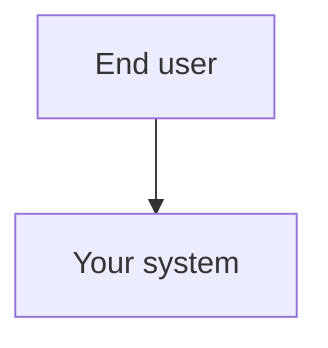
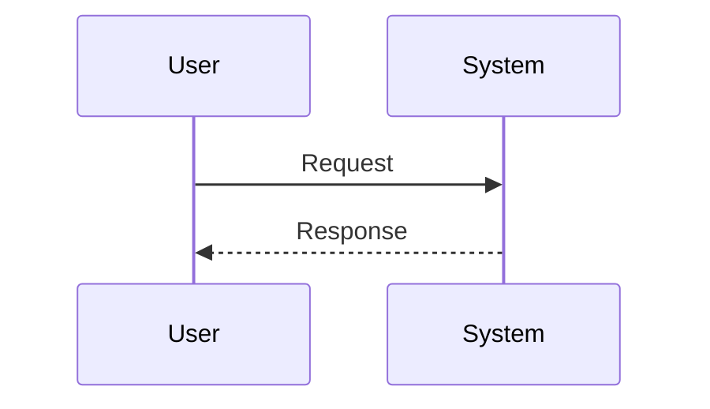

# System design template (YAML specification)

Use this template to document **your product or system**. The deliverable is a YAML file in the same structure as `sample_data/plan_change_bundle.yaml`. The markdown HLD/LLD describes the system; the YAML is the structured copy of that design.

**Example:** [Plan_Change_HLD_LLD.md](./Plan_Change_HLD_LLD.md) — Plan Change system (mobile plan change).

---

## Document control

| Field | Value |
|-------|--------|
| System name | |
| Specification file | e.g. `my_system.yaml` |
| Version | |
| Author / date | |

---

# Part 1 — High-Level Design (HLD)

### 1.1 Purpose

_What problem does this system solve?_

### 1.2 Actors

| Actor | Role |
|-------|------|
| | |

### 1.3 Scope

**In scope**

| Step | Capability | Summary |
|------|------------|---------|
| 1 | | |
| 2 | | |

**Out of scope**

| Item | Reason |
|------|--------|
| | |

### 1.4 Context diagram



### 1.5 User journey


**Requirement narrative:**  
_As a … I want … so that … (include API paths used.)_

**Flow order:** FeatureA → FeatureB → FeatureC

### 1.6 Capability dependencies

```mermaid
flowchart BT
  %% dependent --> prerequisite
```

### 1.7 API landscape

| Domain | Endpoints | Purpose |
|--------|-----------|---------|
| | | |

### 1.8 Non-functional requirements

| Area | Requirement |
|------|-------------|
| Security | |
| Performance | |

---

# Part 2 — Low-Level Design (LLD)

### 2.1 Requirement specification

| Field | Specification |
|-------|----------------|
| Title | |
| Description | |
| Flow order | |
| APIs referenced | |

### 2.2 Capability specifications

| Capability | Description | APIs | Depends on |
|------------|-------------|------|------------|
| | | | |

### 2.3 API specification

Document each operation (full schemas go in YAML `openapi.paths`).

| Operation | Method | Path | Request | Success | Error |
|-----------|--------|------|---------|---------|-------|
| | | | | | |

### 2.4 Test specification

| Test ID | Scope | Type | Title | Expected |
|---------|-------|------|-------|----------|
| | | | | |

### 2.5 Data model

| Entity | Attributes | Used in |
|--------|------------|---------|
| | | |

### 2.6 Sequence — main flow



---

# Part 3 — YAML specification structure

Encode the design in one file:

```yaml
kind: knowledge_graph_bundle
title: "<System name> — <version>"

openapi:
  openapi: 3.0.0
  info:
    title: ""
    version: "1.0.0"
  paths: {}

features:
  - name: CapabilityName
    description: ""
    apis_used: []
    depends_on: []

test_cases:
  - tc_id: TC-001
    linked_to: CapabilityName    # or POST:/path
    title: ""
    type: positive
    test_layer: api
    steps: []
    expected_result: ""

user_story:
  title: ""
  content: ""
  flows: []
  depends_on: []
  blocked_by: []
```

| YAML section | HLD/LLD section |
|--------------|-----------------|
| `user_story` | Part 2.1 |
| `features` | Part 2.2 |
| `openapi` | Part 2.3 |
| `test_cases` | Part 2.4 |

---

## Sign-off

| Role | Name | Date |
|------|------|------|
| Product | | |
| Engineering | | |
| QA | | |
