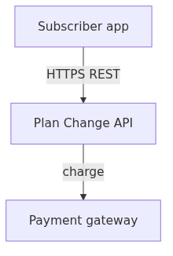
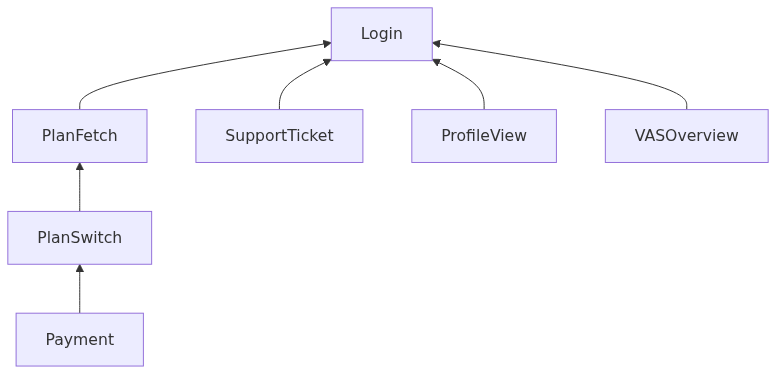
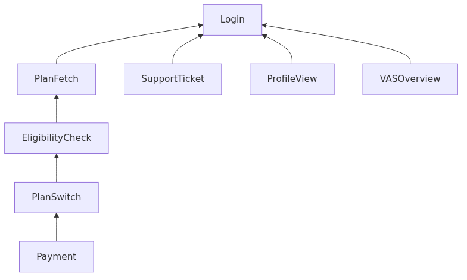
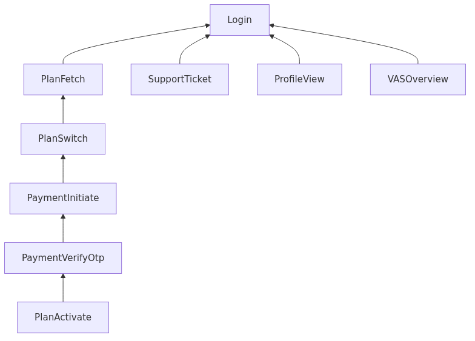
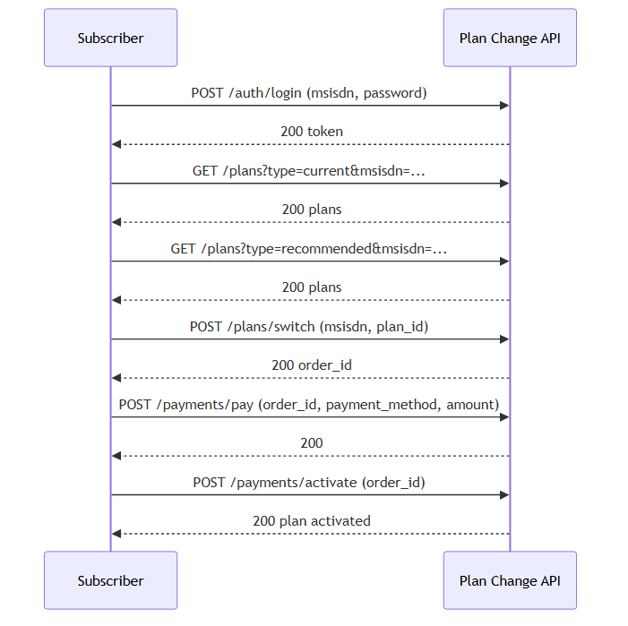

---
puppeteer:
  printBackground: true
---

# Plan Change — System Design (HLD & LLD)

| Item | Value |
|------|--------|
| **System** | Plan Change |
| **API** | Plan Change API v1.0.0 |
| **Primary capability** | Subscriber changes mobile plan online |

This document describes the **Plan Change system** — authentication, catalog, order, payment, and activation.

---

## Part 1 — High-Level Design (HLD)

### 1.1 Purpose

Allow a mobile subscriber to **change their current plan**: sign in, compare current and recommended plans, place a switch order, pay, and activate the new plan.

### 1.2 Actors

| Actor | Role |
|-------|------|
| Subscriber | Uses mobile app / web to change plan |
| Plan Change API | Backend REST services for the journey |
| Payment provider | Processes payment (UPI / card / wallet) |
| QA | Executes automated and manual tests |

### 1.3 Scope

**In scope (plan-change journey)**

| Step | Capability | Summary |
|------|------------|---------|
| 1 | Login | Authenticate with MSISDN + password; optional token refresh |
| 2 | PlanFetch | List current and recommended plans |
| 3 | PlanSwitch | Create plan switch order (`order_id`) |
| 4 | Payment | Pay for order and activate plan |

**Also specified (not in default v1 journey)**

| Capability | Role |
|------------|------|
| EligibilityCheck | Validate eligibility before switch (v2 extension) |
| SupportTicket, ProfileView, VASOverview | Separate product areas — share login only |

**Out of default journey**

Support, profile, and VAS APIs exist in the system but are not part of the core plan-change flow.

### 1.4 Context diagram

### 1.5 Journeys by release (v1, v2, v3)

| Version | Change vs previous |
|---------|-------------------|
| **v1** |  Baseline plan-change journey |
| **v2** | Adds **EligibilityCheck** before switch |
| **v3** | Replaces direct **Payment** with OTP payment chain |

#### Journey — v1 (baseline)

**Flow:** Login → PlanFetch → PlanSwitch → Payment

#### Journey — v2 (eligibility)

**Flow:** Login → PlanFetch → **EligibilityCheck** → PlanSwitch → Payment

#### Journey — v3 (OTP payment)

**Flow:** Login → PlanFetch → PlanSwitch → **PaymentInitiate** → **PaymentVerifyOtp** → **PlanActivate**

### 1.6 Capability dependencies by release

Arrows: dependent capability → prerequisite. Standalone capabilities (Support, Profile, VAS) depend only on **Login**.

#### Capabilities — v1

#### Capabilities — v2

#### Capabilities — v3

> v3 drops **EligibilityCheck** from the journey and replaces **Payment** with the OTP payment chain.

### 1.8 API landscape

| Domain | Endpoints | Purpose |
|--------|-----------|---------|
| Authentication | `POST /auth/login`, `POST /auth/token/refresh` | Session |
| Plans | `GET /plans`, `POST /plans/switch`, `POST /plans/eligibility-check`, `POST /plans/activate` | Catalog, order, eligibility, activation (v3) |
| Payments | `POST /payments/pay`, `POST /payments/activate` (v1/v2); `POST /payments/initiate`, `POST /payments/verify-otp` (v3) | Pay and activate |
| Support | `POST /support/tickets` | Tickets (standalone) |
| Profile | `GET /profile/details` | Profile (standalone) |
| VAS | `GET /vas/subscriptions` | Subscriptions (standalone) |

### 1.9 Non-functional requirements

| Area | Requirement |
|------|-------------|
| Security | Authenticated access after login; 401 when session invalid |
| Data | Operations keyed by `msisdn`, `order_id`, `plan_id` |
| Errors | Documented 4xx/402 responses for negative scenarios |
| Testability | Positive and negative tests per critical capability |

---

## Part 2 — Low-Level Design (LLD)

### 2.1 Requirement specification

| Field | Specification |
|-------|----------------|
| Title | Plan Change |
| Description | Subscriber changes mobile plan: login → view plans → switch → pay → activate |
| Flow order | Login, PlanFetch, PlanSwitch, Payment |
| APIs referenced | `POST /auth/login`, `GET /plans`, `POST /plans/switch`, `POST /payments/pay`, `POST /payments/activate` |

### 2.2 Capability specifications

| Capability | Description | APIs | Depends on |
|------------|-------------|------|------------|
| Login | Authenticates user; returns session token | `/auth/login`, `/auth/token/refresh` | — |
| PlanFetch | Current and recommended plans | `GET /plans` | Login |
| EligibilityCheck | Validates plan eligibility (v2) | `POST /plans/eligibility-check` | PlanFetch |
| PlanSwitch | Creates switch order | `POST /plans/switch` | EligibilityCheck (v2); PlanFetch (v1, v3) |
| Payment | Pay and activate (v1/v2) | `POST /payments/pay`, `POST /payments/activate` | PlanSwitch |
| PaymentInitiate | Starts OTP payment (v3) | `POST /payments/initiate` | PlanSwitch |
| PaymentVerifyOtp | Verifies payment OTP (v3) | `POST /payments/verify-otp` | PaymentInitiate |
| PlanActivate | Activates plan after OTP (v3) | `POST /plans/activate` | PaymentVerifyOtp |
| SupportTicket | Raise support ticket | `POST /support/tickets` | Login |
| ProfileView | Read profile | `GET /profile/details` | Login |
| VASOverview | List VAS | `GET /vas/subscriptions` | Login |

#### Authentication

| Operation | Method | Path | Request | Success | Error |
|-----------|--------|------|---------|---------|-------|
| Login | POST | `/auth/login` | `msisdn`, `password` | 200, `token`, `user_id` | 401 |
| Refresh token | POST | `/auth/token/refresh` | `refresh_token` | 200 | — |

#### Plans

| Operation | Method | Path | Request | Success | Error |
|-----------|--------|------|---------|---------|-------|
| List plans | GET | `/plans` | Query: `type` (current or recommended), `msisdn` | 200, `plans[]` | 401 |
| Switch plan | POST | `/plans/switch` | `msisdn`, `plan_id` | 200, `order_id` | 400 |
| Eligibility | POST | `/plans/eligibility-check` | `msisdn`, `plan_id` | 200, `eligible`, `reason` | 400 |

#### Payments

| Operation | Method | Path | Request | Success | Error |
|-----------|--------|------|---------|---------|-------|
| Pay | POST | `/payments/pay` | `order_id`, `payment_method` (upi, card, or wallet), `amount` | 200 | 402 |
| Activate (after pay) | POST | `/payments/activate` | `order_id` | 200 | 404 |
| Initiate OTP payment (v3) | POST | `/payments/initiate` | `order_id`, `payment_method` | 200, OTP sent | — |
| Verify OTP (v3) | POST | `/payments/verify-otp` | `order_id`, `otp` | 200 | 400 |
| Activate plan (v3) | POST | `/plans/activate` | `order_id` | 200 | 404 |

#### Standalone APIs

| Operation | Method | Path |
|-----------|--------|------|
| Support ticket | POST | `/support/tickets` |
| Profile | GET | `/profile/details` |
| VAS list | GET | `/vas/subscriptions` |

### 2.4 Test specification

| Test ID | Scope | Type | Title | Expected |
|---------|-------|------|-------|----------|
| TC-login-001 | Login | Positive | Valid login with correct credentials | HTTP 200, session token |
| TC-login-002 | Login | Negative | Login with wrong password | HTTP 401 |
| TC-API-login-401 | `POST /auth/login` | Negative | API returns 401 for invalid credentials | HTTP 401 |
| TC-planfetch-001 | PlanFetch | Positive | Fetch current and recommended plans | HTTP 200 |
| TC-planfetch-002 | PlanFetch | Negative | Fetch plans without authentication | HTTP 401 |

**Test attributes**

| Attribute | Values |
|-----------|--------|
| `type` | positive, negative |
| `test_layer` | api |
| `steps` | Ordered actions |
| `expected_result` | HTTP status and outcome |

### 2.5 Data model (logical)

| Entity | Attributes | Used in |
|--------|------------|---------|
| Subscriber | `msisdn` | Login, plans, switch, eligibility |
| Session | `token`, `user_id` | Authenticated calls |
| Plan | `plan_id` | Switch, eligibility |
| Order | `order_id` | Payment, activation |
| Payment | `payment_method`, `amount` | Pay and activate |

### 2.6 Sequence — happy path (v1)

